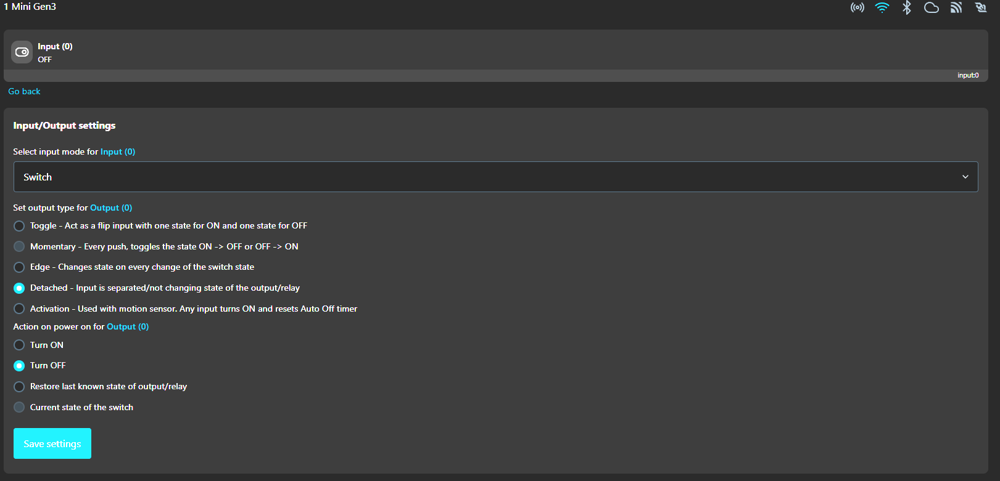
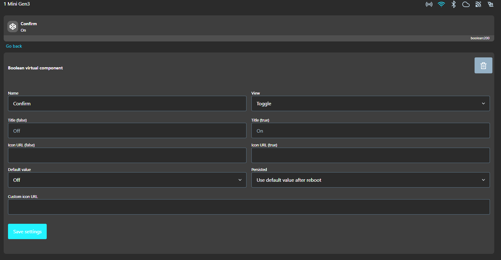
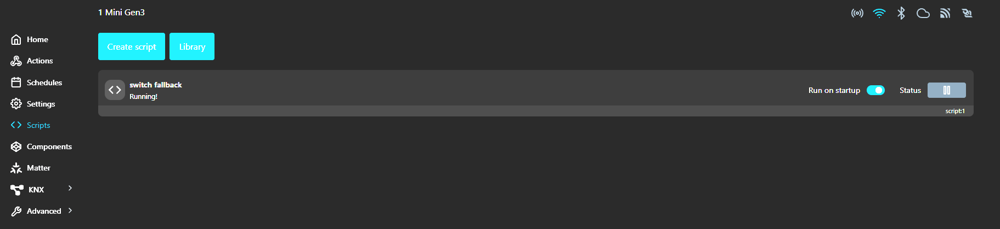
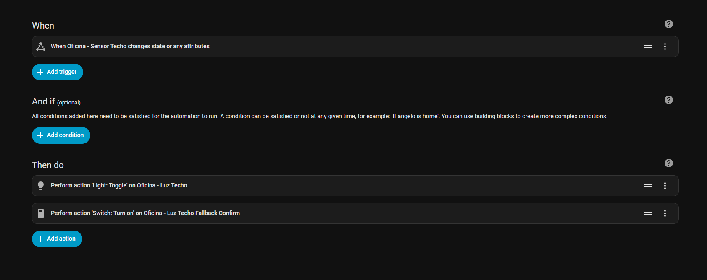

# ✅ Step 1 — Add the Shelly 1 Mini to Home Assistant

Before wiring the switch or button, we first need to set up the Shelly 1 Mini and connect it to your home Wi-Fi so Home Assistant can discover it.

## 1. Power the Shelly 1 Mini

Connect the device to mains power using the L (Live) and N (Neutral) pins.  
Once the Shelly powers on, it will automatically create its own temporary Wi-Fi network.

⚠️ **Safety reminder:** Only power the Shelly with proper insulation and without touching any exposed wires.

## 2. Connect to the Shelly Wi-Fi network

Using a smartphone, tablet, or laptop:

1. Open your Wi-Fi settings
2. Look for a network named similar to:  
   `Shelly1Mini-XXXXXX`
3. Connect to that network (no password required)

## 3. Access the Shelly configuration page

Once connected to the Shelly’s Wi-Fi:

1. Open a web browser
2. Enter the following address:  
   `http://192.168.33.1`

This will load the Shelly’s built-in configuration interface.

## 4. Configure your home Wi-Fi

Inside the Shelly interface:

1. Go to **Settings → WiFi**
2. Enable **WiFi 1**
3. Enter your Wi-Fi SSID (network name)
4. Enter your Wi-Fi password
5. Save and reboot if prompted

The Shelly will now disconnect from its temporary network and connect to your home network.

## 5. Home Assistant will discover it

After a few seconds, Home Assistant should automatically detect the Shelly 1 Mini and show a notification such as:

> “New device discovered: Shelly 1 Mini”

Click **Add**, assign it to an area, and finish the setup.

---

# ✅ Step 2 — Configure the Shelly 1 Mini for Smart + Fallback Operation

With the Shelly already connected to your Wi-Fi and added to Home Assistant, we now need to adjust its internal settings. These settings allow the Shelly to work independently from Home Assistant (fallback mode) while also allowing HA to control the light normally.

## 2.1 Access the Shelly Web Interface

The easiest way to access the Shelly’s local web interface is from inside Home Assistant:

1. Open Home Assistant
2. Go to **Settings → Devices & Integrations**
3. Select the Shelly integration
4. Click on your **Shelly 1 Mini**
5. Click **Visit**

Home Assistant will open a new browser tab with the Shelly’s local web interface.

## 2.2 Configure Input and Output Behavior

Once inside the Shelly interface:

1. Go to **Home → Input 0 → Input/Output Settings**
2. Adjust the following options:

- **Input mode for Input (0)**  
  Select: `Switch`

- **Set output type for Output (0)**  
  Select: `Detached – Input is separated / not changing the state of the output/relay`

This ensures that the physical switch/button does not directly toggle the relay, which is required for the fallback logic and for using a smart bulb.

- **Action on power on for Output (0)**  
  Select: `Turn OFF`

This ensures the relay does not unintentionally activate after a power outage.

After selecting all these, save the changes.

At this point the configuration should match the example shown in your screenshot 

## 2.3 Create the Virtual “Confirm” Component

To support fallback operation (so the light can always turn on or off even when Home Assistant is offline), we need a virtual boolean inside the Shelly. This virtual component is used by automation logic to confirm the desired state.

1. In the Shelly interface, go to **Components**
2. Click **Create New**
3. Select **Type:** `Boolean`
4. Set the name to: `Confirm`
5. Save the component

It should now appear just like in 

## 2.4 Create the Fallback Script

To complete the fallback mechanism, we need a script running directly on the Shelly 1 Mini.  
This script monitors the physical switch/button and toggles the relay only if Home Assistant does not confirm the action within a fixed timeout.  
This guarantees that the light can always be controlled even when Home Assistant is offline.

### How to add the script

1. In the Shelly web interface, go to **Scripts**
2. Click **Create Script**
3. Paste the following code into the editor
4. Save and enable the script

```javascript
// Shelly 1 Mini Gen4 script
// Input: detached SWITCH (input:0)
// Relay: switch:0
// Virtual boolean: id=200 ("Confirm")

let SW_INPUT   = 0;
let SW_OUTPUT  = 0;
let CONFIRMED_ID = 200;
let TIMEOUT_MS = 2200;

// Get handle for the virtual boolean
let confirmed = Virtual.getHandle("boolean:" + CONFIRMED_ID);

Shelly.addEventHandler(function(ev) {
  if (ev.component === "input:" + SW_INPUT && ev.info.event === "toggle") {
    handleToggle();
  }
});

function handleToggle() {
  confirmed.setValue(false);
  
  // Get relay status synchronously
  let swStatus = Shelly.getComponentStatus("switch:" + SW_OUTPUT);
  let relayIsOn = !!swStatus.output;
  
  if (!relayIsOn) {
    // If relay is OFF -> turn it ON
    Shelly.call("Switch.Set", { id: SW_OUTPUT, on: true });
    return;
  }

  Timer.set(TIMEOUT_MS, false, function() {
    if (!confirmed.getValue()) {
      // Not confirmed -> turn relay OFF
      Shelly.call("Switch.Set", { id: SW_OUTPUT, on: false });
    }
  });
}
```

### What the script does

- Detects a toggle on the physical input switch
- Temporarily activates the relay
- Waits for Home Assistant to update the virtual boolean `Confirm`
- If HA does not confirm the action within `TIMEOUT_MS`, the Shelly assumes HA is offline and toggles the relay itself
- Ensures reliable light control no matter what

## 2.5 Enable and Run the Script

Once the script has been created, make sure it is active so the fallback logic always runs correctly.

1. Click **Save**
2. Enable the script by switching **Run** to `ON`
3. Make sure **Run on startup** is also enabled

Your script screen should now look like the example shown in  

---

# ✅ Step 3 — Create the Home Assistant Automation

Now that the Shelly fallback script is running, we must create a Home Assistant automation that reacts to changes on the Shelly’s input.  
This automation performs two critical actions:

1. Toggles the smart bulb (the real light source)
2. Sets the virtual boolean “Confirm” to true, telling the Shelly that Home Assistant received the toggle event

### Why this is important

- When the physical switch/button is toggled:  
  The Shelly script immediately sets `Confirm = false` and starts a timeout.  
  Home Assistant automation runs and sets `Confirm = true`.  
  The Shelly sees the confirmation after the timeout and does not change the relay state, because HA already handled the light.

- If Home Assistant is offline or frozen:  
  The automation never runs → `Confirm` stays false.  
  When the timeout ends, the Shelly toggles the relay itself → fallback mode works.  

This ensures that the light always responds, even without Home Assistant.

## 3.1 Creating the automation

In Home Assistant:

1. Go to **Settings → Automations & Scenes**
2. Click **Create Automation**
3. Choose **Create new automation**
4. Configure the trigger and actions as shown below
5. Adjust the entity names to match your setup

Your automation should look similar to the screenshot 

## 3.2 Example YAML for the automation

Replace the entity IDs with the ones used in your installation:

```yaml
alias: Oficina - Interruptor - Encender/Apagar
triggers:
  - trigger: state
    entity_id:
      - binary_sensor.oficina_techo
actions:
  - action: light.toggle
    target:
      entity_id:
        - light.oficina_techo
    data: {}
  - action: switch.turn_on
    target:
      entity_id:
        - switch.oficina_luz_techo_fallback_confirm
    data: {}
mode: single
```

### Explanation

- `binary_sensor.oficina_techo` → This is the input state of the Shelly (the physical switch/button)  
- `light.oficina_techo` → Your smart bulb  
- `switch.oficina_luz_techo_fallback_confirm` → The virtual boolean component created earlier (“Confirm”)

---

# ✅ Step 4 — Wiring the Shelly 1 Mini

The final step is connecting the Shelly 1 Mini correctly to your mains, the smart bulb, and the physical switch.

## 4.1 Shelly 1 Mini connections

- **N (Neutral):** Connect the neutral wire from your mains  
- **L (Live):** Connect the live wire from your mains  
- **I (Input):** Connect the live wire from your mains (same as L)  
- **O (Output):** Connect the wire that goes to the smart bulb  
- **SW (Switch):** Connect the wire coming from the physical switch

## 4.2 Wiring logic

- **Power (L & N):** Powers the Shelly itself  
- **SW input:** Detects toggle events from the physical switch  
- **O output:** Sends current to the smart bulb, controlled by Shelly script and HA  
- **I:** Used in combination with SW for detached mode

## 4.3 Diagram

```yaml
Mains L  ──┐
            ├─> L (Shelly)
 SW ────────> SW (Shelly)
 N ─────────> N (Shelly)
            └─> I (Shelly)
 O (Shelly) ──> Smart Bulb
 ```

> ⚠️ Ensure all wiring is done safely and with power turned off before connecting.  
> ⚠️ Double-check connections before powering the device.